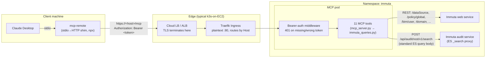
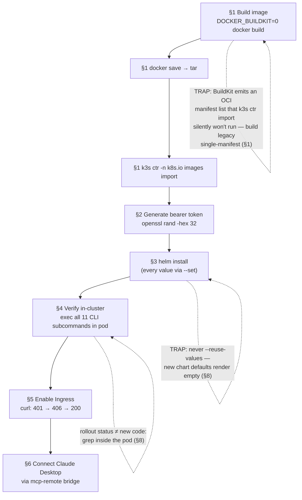

# Immuta MCP — Deployment

Build the image on a k3s host, import it into containerd, install the Helm
chart with explicit values, expose via Ingress, and connect Claude Desktop
through the `mcp-remote` bridge. One release per Immuta tenant; no container
registry required.



---

## 0. Prerequisites

**Immuta side:**

- A **self-managed Immuta 2026.1.x** instance (tested on **2026.1.4**) running
  in a Kubernetes cluster. Other versions will mostly work, but endpoint paths
  drift between Immuta releases — see Troubleshooting for how to find the path
  your version uses when a tool 404s. Immuta SaaS is untested.
- An **Immuta API key** whose user can read datasources, global policies,
  domains, and users (BIM), and can open Insights→Audit in the UI. This is the
  only credential the MCP server needs — it talks to Immuta exclusively over
  HTTP and requires **no** Kubernetes API access, database credentials, or
  ServiceAccount permissions.
- The Immuta **base URL**. From inside the same cluster, prefer the in-cluster
  service URL (e.g. `http://immuta-secure.<namespace>.svc.cluster.local:8823`)
  to avoid egress.

**Cluster side:**

- A k8s cluster — the tested reference is **k3s on EC2** with Traefik as the
  bundled ingress controller and TLS terminating upstream at an AWS load
  balancer. Both assumptions are called out where they matter (§1 and §5) with
  the adjustment for other setups.
- **Helm ≥ 3.14** (needed for `--reset-then-reuse-values` in §8), `kubectl`,
  and **Docker** on the build host.
- **No container registry is needed** for k3s — §1 imports the image into
  containerd directly. If you *do* have a registry, replace §1 with a normal
  `docker build && docker push` and set `image.repository` accordingly; the
  rest of this guide is unchanged.

```bash
kubectl get nodes
helm version --short
```

Expected: node `Ready`; Helm ≥ 3.14.

**The whole path at a glance** (each box is a section below):



---

## 1. Build the image and load into k3s

K3s uses containerd, not Docker, so the built image must be exported and
imported into containerd's image store. No registry needed.

`DOCKER_BUILDKIT=0` and `-n k8s.io` are **load-bearing**. The modern
BuildKit/containerd builder emits an OCI **manifest list with an attestation
manifest**; `docker save` + `k3s ctr images import` of that index does not
reliably become the rootfs the kubelet runs, so a new tag "rolls out" while the
pod keeps old code. The legacy builder emits a single Docker v2 manifest that
imports cleanly. `k3s ctr` defaults to the `k8s.io` namespace, but pass it
explicitly so the image lands where the kubelet reads.

```bash
TAG=0.8
DOCKER_BUILDKIT=0 docker build -t immuta-mcp:$TAG .
docker save immuta-mcp:$TAG -o /tmp/immuta-mcp.tar
sudo k3s ctr -n k8s.io images import /tmp/immuta-mcp.tar && rm /tmp/immuta-mcp.tar
sudo k3s ctr -n k8s.io images ls | grep "immuta-mcp:$TAG"
```

Expected: `docker.io/library/immuta-mcp:0.8` listed in containerd images. (If
`DOCKER_BUILDKIT=0` isn't available, use `docker buildx build
--provenance=false --sbom=false -t immuta-mcp:$TAG --load .` — it also produces
a single-manifest image.)

> **Using a registry instead?** Skip the save/import: `docker build -t
> <registry>/immuta-mcp:$TAG . && docker push <registry>/immuta-mcp:$TAG`, then
> add `--set image.repository=<registry>/immuta-mcp` to every `helm` command
> below. The BuildKit caveat doesn't apply to registry pulls.

---

## 2. Generate a bearer token

The HTTP transport refuses every request without `Authorization: Bearer
<token>` matching `MCP_BEARER_TOKEN`. Keep it long, random, and out of source.

```bash
openssl rand -hex 32
```

Expected: 64-char hex string. Save it in your password manager — you'll paste
it into both the chart install and every client config.

---

## 3. Install the Helm chart

Pass **every** required value with `--set`. Do not use `--reuse-values` — it
ignores new chart defaults and silently leaves env vars empty.

`immuta.baseUrl` is the **Immuta** server's URL (not this MCP server's). Prefer
the in-cluster service URL to avoid egress (e.g.
`http://immuta-secure.immuta.svc.cluster.local:8823`).

```bash
helm install mcp-immuta-prod ./deploy/helm -n immuta --create-namespace \
  --set image.tag=$TAG \
  --set immuta.baseUrl="<IMMUTA_URL>" \
  --set immuta.apiKey="$IMMUTA_API_KEY" \
  --set mcp.bearerToken="$MCP_BEARER_TOKEN"
kubectl -n immuta rollout status deploy/mcp-immuta-prod-immuta-mcp
```

Expected: `deployment "mcp-immuta-prod-immuta-mcp" successfully rolled out`.
Confirm the three required env vars are populated:

```bash
kubectl -n immuta exec deploy/mcp-immuta-prod-immuta-mcp -- env | grep -E 'IMMUTA_BASE_URL|IMMUTA_API_KEY|MCP_BEARER_TOKEN'
```

---

## 4. Verify the tools work in-cluster

Exec each CLI subcommand inside the pod to confirm it can reach Immuta with the
configured key.

```bash
POD=$(kubectl -n immuta get pod -l app.kubernetes.io/instance=mcp-immuta-prod -o name | head -1)
kubectl -n immuta exec "$POD" -- python -m immuta_queries audit --span 1h
kubectl -n immuta exec "$POD" -- python -m immuta_queries audit-aggregate --span 30d -g actor -g day
kubectl -n immuta exec "$POD" -- python -m immuta_queries tag-usage
kubectl -n immuta exec "$POD" -- python -m immuta_queries datasources
kubectl -n immuta exec "$POD" -- python -m immuta_queries datasources-without-policies
kubectl -n immuta exec "$POD" -- python -m immuta_queries policies
kubectl -n immuta exec "$POD" -- python -m immuta_queries policy-attributes
kubectl -n immuta exec "$POD" -- python -m immuta_queries domains
kubectl -n immuta exec "$POD" -- python -m immuta_queries who-has-access -d <id>
kubectl -n immuta exec "$POD" -- python -m immuta_queries datasource-requirements -d <id>
kubectl -n immuta exec "$POD" -- python -m immuta_queries user-access -u <email>
```

Expected: each returns JSON. Empty lists (`[]`) are normal on a fresh Immuta.
Audit returns an `AuditResult` envelope with `"source": "Immuta audit
Elasticsearch API (POST /api/audit/rest/v1/search)"`. **Never** `{"error":
...}` at this stage.

---

## 5. Expose via Ingress

The chart's Ingress is disabled by default. Enable it with one upgrade. In
typical k3s-on-EC2 setups TLS terminates **upstream** of Traefik (AWS ALB/NLB
with wildcard cert) — match the existing pattern; do not pass
`ingress.tls=true` unless cert-manager runs in the cluster.

```bash
# Check the existing pattern first
kubectl get ingress -A
# If existing ingresses show PORTS=80 and work over https://, TLS is upstream — skip tls flags.

helm upgrade mcp-immuta-prod ./deploy/helm -n immuta --reset-then-reuse-values \
  --set ingress.enabled=true \
  --set ingress.className=traefik \
  --set ingress.host=<your-mcp-hostname>
```

If TLS terminates *at* the ingress controller instead (cert-manager Secret
present in the cluster), add `--set ingress.tls=true --set
ingress.tlsSecretName=<secret>`. On non-Traefik clusters, set
`ingress.className` to your IngressClass (`kubectl get ingressclass`).

Then from outside the cluster:

```bash
curl -i https://<your-mcp-hostname>/mcp                                # expect 401
curl -i -H "Authorization: Bearer $MCP_BEARER_TOKEN" \
     https://<your-mcp-hostname>/mcp                                   # expect 406 (GET on SSE endpoint — auth OK)
curl -i -X POST \
  -H "Authorization: Bearer $MCP_BEARER_TOKEN" \
  -H "Accept: application/json, text/event-stream" \
  -H "Content-Type: application/json" \
  -d '{"jsonrpc":"2.0","id":1,"method":"initialize","params":{"protocolVersion":"2025-03-26","capabilities":{},"clientInfo":{"name":"smoke","version":"0"}}}' \
  https://<your-mcp-hostname>/mcp                                      # expect 200 + SSE handshake
```

Expected: 401 → 406 → 200. The 200 response includes `serverInfo.name:
immuta-mcp`.

---

## 6. Connect Claude Desktop on Mac

Claude Desktop's Connectors UI requires OAuth, which this server doesn't yet
implement. Use [`mcp-remote`](https://github.com/geelen/mcp-remote) — a stdio
shim Claude Desktop launches locally that forwards every request to the remote
HTTP MCP with the bearer header attached.

Edit `~/Library/Application Support/Claude/claude_desktop_config.json`:

```json
{
  "mcpServers": {
    "immuta-prod": {
      "command": "npx",
      "args": [
        "-y",
        "mcp-remote@latest",
        "https://<your-mcp-hostname>/mcp",
        "--header",
        "Authorization: Bearer ${MCP_BEARER_TOKEN}",
        "--transport",
        "http-only"
      ],
      "env": {
        "MCP_BEARER_TOKEN": "<bearer token from §2>"
      }
    }
  }
}
```

**Spacing is load-bearing.** The header value must include the literal space
between `Bearer` and `${MCP_BEARER_TOKEN}`. The server checks
`auth.startswith("Bearer ")` with a trailing space; `mcp-remote` sends the
value through verbatim. The no-space form `"Authorization:Bearer${...}"`
documented in `mcp-remote`'s README is a workaround for clients that split args
on whitespace — Claude Desktop preserves JSON array entries as single args, so
the spaced form is correct here. Wrong spacing → 401 → Claude Desktop UI shows
"Server disconnected" / "failed".

Restart Claude Desktop fully (Cmd-Q is not enough; confirm with `pgrep`):

```bash
osascript -e 'quit app "Claude"'
sleep 2
pgrep -fl Claude    # expect empty
open -a "Claude"
```

Expected: new chat → tools icon → 11 `immuta_*` tools listed under
`immuta-prod`. Ask Claude *"Use immuta_audit_events with span 1h"* and you
should get the same `AuditResult` JSON shape as §4.

If the Settings UI shows "Server disconnected" but the bridge appears to work,
**that badge is often stale**. Check the actual log:

```bash
tail -100 ~/Library/Logs/Claude/mcp-server-immuta-prod.log
```

Look for `Message from server: {... "tools": [...] ...}` — if it's there, the
bridge works regardless of the badge.

---

## 7. Rotate the bearer token

Patch the Secret in place and roll the Deployment. No Helm involved — avoids
the `--reuse-values` footgun and the rotation takes one pod restart.

```bash
NEW_TOKEN=$(openssl rand -hex 32)
kubectl -n immuta create secret generic mcp-immuta-prod-immuta-mcp-bearer \
  --from-literal=MCP_BEARER_TOKEN="$NEW_TOKEN" \
  --dry-run=client -o yaml | kubectl apply -f -
kubectl -n immuta rollout restart deploy/mcp-immuta-prod-immuta-mcp
kubectl -n immuta rollout status  deploy/mcp-immuta-prod-immuta-mcp
echo "NEW_TOKEN=$NEW_TOKEN"
```

Update every client config (the Claude Desktop entry's `MCP_BEARER_TOKEN` env
value) and restart the client. Expected: old token returns 401; new token
returns 200.

For `IMMUTA_API_KEY`, repeat with secret `mcp-immuta-prod-immuta-mcp-immuta`
and key `IMMUTA_API_KEY`.

---

## 8. Upgrade the image

Use `--reset-then-reuse-values` (Helm 3.14+) so new chart defaults are applied
while your previously-set values are preserved. **Never `--reuse-values`** — it
ignores new chart defaults.

Build single-manifest and import into `k8s.io` (see §1 — this is the step that
silently fails otherwise). Always bump `NEW_TAG`; `rollout restart` forces pod
recreation even if image resolution is confused.

```bash
git pull
NEW_TAG=0.9
DOCKER_BUILDKIT=0 docker build -t immuta-mcp:$NEW_TAG .
docker save immuta-mcp:$NEW_TAG -o /tmp/immuta-mcp.tar
sudo k3s ctr -n k8s.io images import /tmp/immuta-mcp.tar && rm /tmp/immuta-mcp.tar
sudo k3s ctr -n k8s.io images ls | grep "immuta-mcp:$NEW_TAG"   # confirm new tag present

helm upgrade mcp-immuta-prod ./deploy/helm -n immuta --reset-then-reuse-values \
  --set image.tag=$NEW_TAG
kubectl -n immuta rollout restart deploy/mcp-immuta-prod-immuta-mcp
kubectl -n immuta rollout status  deploy/mcp-immuta-prod-immuta-mcp
```

**Verify the new code is actually in the pod** — `rollout status` only proves
the pod started, not that it has the new code. Grep a string unique to this
release *inside* the running container:

```bash
kubectl -n immuta exec deploy/mcp-immuta-prod-immuta-mcp -- grep -c rest/v1/search immuta_queries.py
```

Expected: a non-zero count (the audit ES route is present), then re-run §4
smoke tests.

---

## Troubleshooting

### Discovering moved/renamed Immuta endpoints

Immuta API paths drift between self-managed versions, and every endpoint path
in this codebase lives at exactly one `_get(...)`/`_post(...)` call site in
`immuta_queries.py` — a tool's 404 error includes the `endpoint` field naming
the path, which points at the one line to edit. To find the path *your* Immuta
version uses, probe the live instance read-only:

1. **Gateway probe:** `/api/<service>` gateway paths return **400 "path is
   required"** when the service exists (vs plain 404 when it doesn't), so you
   can confirm a service is mounted before hunting for its routes.
2. **Grep the UI bundle:** the Angular UI bundle (`main.<hash>.js`, served at
   the Immuta base URL) contains the literal endpoint strings the UI itself
   calls — e.g. `this.httpService.post("/api/audit/rest/v1/search", …)`.
   Whatever the UI uses for the equivalent screen is the durable route.

### Symptom table

| Symptom | Cause | Fix |
|---|---|---|
| Claude Desktop shows "Server disconnected" / "failed" | Almost always wrong bearer header spacing in `mcp-remote` config | Use `"Authorization: Bearer ${MCP_BEARER_TOKEN}"` (literal spaces). See §6. |
| Ingress hostname returns 404 (not 401) | No Ingress rule matches that Host | `kubectl get ingress -A`; ensure the chart's Ingress is enabled and `ingress.host` matches your DNS |
| Ingress returns redirect-loop or TLS error after `ingress.tls=true` | TLS already terminates upstream of Traefik | Drop `ingress.tls=*` flags; match the existing ingresses' pattern (`PORTS 80` only is the tell) |
| Tool returns `{"error":{"status_code":404,"endpoint":"..."}}` | Immuta endpoint path differs in your version | The `endpoint` field points at the exact line to adjust in [immuta_queries.py](immuta_queries.py); find the new path per "Discovering moved/renamed Immuta endpoints" above |
| Audit returns `{"error":{...,"endpoint":"/api/audit/rest/v1/search"}}` | API key lacks audit permission, or the audit ES route differs in your version | Confirm the key can open Insights→Audit in the UI; check the route still 200s |
| Audit `truncated: true` | More than `MAX_AUDIT_EVENTS` (1000) matched the window | Expected — narrow `--span` to page through the rest |
| Pod stuck `ImagePullBackOff` | Image not loaded into k3s containerd | Re-run §1 import; confirm with `sudo k3s ctr -n k8s.io images ls \| grep immuta-mcp` |
| Rollout "successful" but pod still runs old code | `docker build` produced an OCI attestation/manifest-list image that `k3s ctr import` doesn't run; new tag never became the rootfs | Rebuild with `DOCKER_BUILDKIT=0` and import with `-n k8s.io` (§1/§8); `kubectl rollout restart`; confirm with the in-pod `grep` above |
