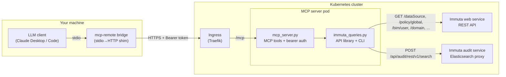

# Immuta MCP

An [MCP](https://modelcontextprotocol.io) server that exposes eleven
governance/audit queries against a **self-managed Immuta** instance to LLM
clients (Claude Desktop, Claude Code, or any MCP-capable client). Ask questions
like *"who has access to datasource X and why?"* or *"show me query activity by
user over the last month"* in plain language; the LLM answers them by calling
these tools.

Licensed under [Apache-2.0](LICENSE). Contributions welcome — see
[CONTRIBUTING.md](CONTRIBUTING.md).

## Architecture

Two Python modules, one direction of dependency. All Immuta API knowledge lives
in `immuta_queries.py` (also usable standalone as a CLI); `mcp_server.py` is a
thin MCP wrapper over it.



For local use the bridge and Ingress drop out: the client spawns the server as
a subprocess over stdio (no token needed).

## Tools exposed

| Tool | Question answered |
|---|---|
| `immuta_datasources` | List/search datasources by name substring, tag, or domain |
| `immuta_datasources_without_policies` | Which datasources have no policies attached? |
| `immuta_datasource_requirements` | What must a user satisfy to read datasource X, and what gets masked/filtered? |
| `immuta_who_has_access` | Who has access to datasource X, and why? |
| `immuta_user_access` | What can user X access and why — or what would they need for datasource Y? |
| `immuta_domains` | What domains exist, which datasources are in each, who holds which domain permissions? |
| `immuta_policies` | What global policies exist, with what rules and conditions? |
| `immuta_policy_attributes_with_user_counts` | What attributes do policies reference, and how many users match? |
| `immuta_tag_usage` | Which tags are in use, and where? |
| `immuta_audit_events` | Show individual audit events in a window (filterable by actor/action, capped) |
| `immuta_audit_aggregate` | Audit counts/trends aggregated inside Elasticsearch — for "activity by user over a month" questions |

Every tool is also a CLI subcommand of `immuta_queries.py` for human/script use.

## Prerequisites

**Immuta:**

- A **self-managed Immuta 2026.1.x** instance (developed and tested against
  **2026.1.4**). Endpoint paths drift between Immuta versions; on other
  versions some tools may return `{"error": {"status_code": 404, "endpoint":
  "..."}}` — the `endpoint` field names the exact path to adjust in
  `immuta_queries.py`, and [DEPLOYMENT.md](DEPLOYMENT.md) (Troubleshooting)
  describes how to discover the path your version uses. Immuta SaaS is
  untested.
- An **Immuta API key** whose user can read datasources, global policies,
  domains, users (BIM), and open Insights→Audit in the UI. This is the only
  credential the server needs — it has no database or Kubernetes access.

**Local development:**

- Python ≥ 3.13 and [uv](https://docs.astral.sh/uv/) (the repo ships a
  `uv.lock`).

**Cluster deployment (optional — only to serve remote clients):**

- A Kubernetes cluster, ideally the one running Immuta. The tested reference
  is **k3s**; any distribution works with minor adjustments.
- **Helm ≥ 3.14** and **Docker** (or any OCI image builder).
- No container registry is required for k3s — the image is imported into
  containerd directly. With a registry, plain `docker push` works too.

## Quick start (local, no cluster)

```bash
git clone <this-repo> && cd <this-repo>
uv sync
cp .env.example .env        # fill in IMMUTA_API_KEY + IMMUTA_BASE_URL

# Exercise the library directly via its CLI — each prints JSON to stdout
uv run python -m immuta_queries datasources
uv run python -m immuta_queries tag-usage
uv run python -m immuta_queries audit --span 1h
uv run python -m immuta_queries audit-aggregate --span 30d -g actor -g day

# Run the MCP server for a local client (spawned subprocess, stdio)
uv run python -m mcp_server --transport stdio

# Or as an HTTP service (requires a bearer token; fails closed without one)
MCP_BEARER_TOKEN=devtoken uv run python -m mcp_server --transport http --port 8080
```

Expected: CLI calls print JSON (empty lists are normal on a fresh Immuta). The
HTTP server returns 401 without the bearer token and 200 with it.

For a stdio client config (e.g. Claude Desktop running on the same machine):

```json
{
  "mcpServers": {
    "immuta": {
      "command": "uv",
      "args": ["run", "--directory", "/path/to/this/repo", "python", "-m", "mcp_server", "--transport", "stdio"],
      "env": {
        "IMMUTA_API_KEY": "<api key>",
        "IMMUTA_BASE_URL": "https://<your-immuta-hostname>"
      }
    }
  }
}
```

## Deploy to a cluster

See [DEPLOYMENT.md](DEPLOYMENT.md) for the full path: image build (with the k3s
containerd gotchas spelled out), Helm install, in-cluster verification, Ingress
exposure, Claude Desktop via `mcp-remote`, token rotation, upgrades, and a
troubleshooting table. Deploy **one Helm release per Immuta instance** — the
server is intentionally single-tenant.

## Configuration reference

| Env var | Required | Purpose |
|---|---|---|
| `IMMUTA_BASE_URL` | always | Base URL of the Immuta instance |
| `IMMUTA_API_KEY` | always | API key used for every Immuta call |
| `MCP_BEARER_TOKEN` | HTTP transport only | Shared secret clients must send as `Authorization: Bearer <token>` |

All other knobs (image tag, ingress host, resource limits) are Helm values —
see [deploy/helm/values.yaml](deploy/helm/values.yaml).
